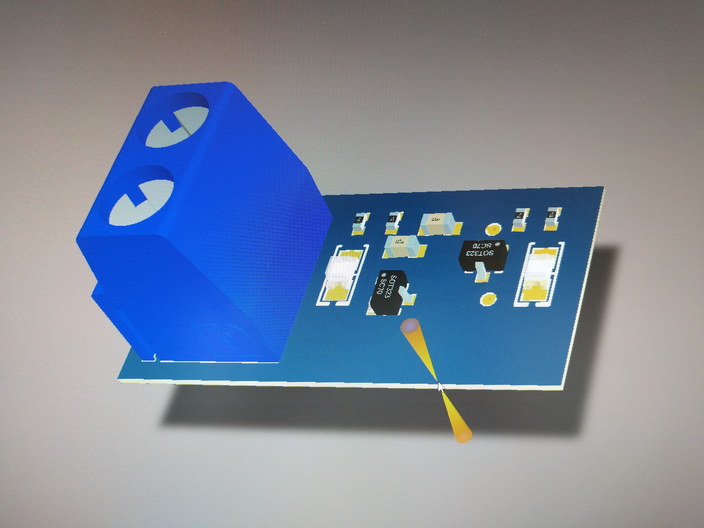
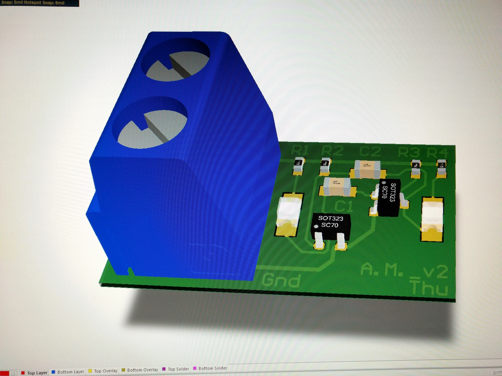

<a name="header0"><h1>READ ME</h1></a>
In this project I prototyped a LED Blinker PCB, or in essence, an Astable Multivibrator with 2 LEDs.

I did most of the work at my internship company RF Frontend (Kamp-Lintfort), where I had the chance to do entirely or 
partly participate in every step of PCB prototyping procedure. 
############
<h2><a name="header1">Project Track</a></h2>
[<ul> 1. Schematic design and simulation in QUCS</ul>](#header3)
[<ul> 2. Breadboard prototyping and testing</ul>](#header4)
[<ul> 3. Schematic design and PCB layout in Altium Designer</ul>](#header5)
[<ul> 4. PCB production</ul>](#header6)
[<ul> 5. PCB populating and testing</ul>](#header7)
[<ul> 6. Modification and finalization</ul>](#header8)

<h2> <a name="header2">Components list </a></h2>
<b><i>For breadboard prototyping:</i></b>
<ul> 2 x 5mm LEDs</ul>
<ul> 2 x BC517 Darlington NPN Transistor</ul>
<ul> 2 x 330 Ohm through-hole resistors</ul>
<ul> 2 x 68K through-hole resistors (values variable, see further down)</ul>
<ul> 2 x 22uF through-hole capaciors (values variable, see further down)</ul>

<b><i>For PCB prototyping:</i></b>

Package sizes (0805/0603/0402) and footprints (SOT323/SOT23) can be variable, here I just use whichever are available. 
Thus, it is recommended to check the component package and footprint before designing a PCB layout.

<ul> 2 x SMD LEDs, 0805 </ul>
<ul> 2 x 330 Ohm SMD resistors, 0402</ul>
<ul> 2 x 68K SMD resistors, 0402</ul>
<ul> 2 x 22uF SMD capacitors, 0603</ul>
<ul> 2 x BFU550W SMD transistors, SOT323</ul>
<ul> 1 x Terminal connector (or 2 pin headers) </ul>

<i>Fig 1. SMD components used for prototyping</i>

<a name="header3"><h2>1. Schematic design and simulation in QUCS</h2></a>

<i>Fig 2. Schematic design and simulation using QUCS, an open source circuit simulator</i>

How the LED Blinker/ Astable Multivibrator works: The 2 capacitors C1 and C2 alternatively charges and discharges, 
which causes the transistors Q2 and Q1 to alternately turn on and off respectively. The transistors switch their state 
based on whether the base voltage is below or above 0.6V, thus switch LEDs on or off accordingly.

Thus the frequency of the blinking LED can be changed by changing the value of C1, C2 to adjust the charging/discharging time.
It can also be varied by varying the input voltage or the values of the resistors R2, R3. 

The resistors R1, R4 are merely current limiting resistors to let the LEDs operate reliably.

The periodic time of the circuit can be calculated based on the formula: T = t1 + t2 = 0.69C1R3 + 0.69C2R2

The values of capacitors and resistors I am using allow each LED to blink at a frequency of 1 Hz, meaning each lights up for 1s
and off for 1s.

<a name="header4"><h2>2. Breadboard prototyping and testing</h2></a>

<i>Fig 3. Breadboard prototyping</i>

After verifying that my circuit works fine on breadboard using 5V DC supply, I went on to design a PCB layout for the circuit.

<a name="header5"><h2>3. Schematic design and PCB layout in Altium Designer</h2></a>

Tips for PCB layout design at this point:
<l><i>Get to know which components footprint/ packages available with you and load them for </i></l>

<l><i>Keep the traces as short as possible</i></l>

<h3>Version 1:</h3>

<l>2D View</l>

<l>3D View</l>

<i>Fig 4, 5. 2D and 3D view layout for PCB version 1 in Altium Designer</i>

<h3>Version 2:</h3>

<l>2D View</l>

<l>3D View</l>

<i>Fig 6, 7. 2D and 3D view layout for PCB version 2 in ALtium Designer</i>

<a name="header6"><h2>4. PCB production</h2></a>
<h3>Version 1:</h3>

<i>Fig 8. My first batch of PCB version 1</i>

<h3>Version 2:</h3>

<i>Fig 9. Comparison of PCB version 1 (top) and PCB version 2 (bottom)</i>

<a name="header7"><h2>5. PCB populating and testing</h2></a>
<h3>Version 1:</h3>

<i>Fig 10. Testing after populating PCB version 1</i>

<h3>Version 2:</h3>

<i>Fig 11. PCB version 2 after populating</i>

<a name="header8"><h2>6. Modification and finalization</h2></a>

It is possible to pack the components even closer together and thus reduce the size of the board further. Also, it is recommended to
always keep a ground plate at the bottom layer and distribute vias to ground across the PCB at certain intervals, so that 
the PCB functions more reliably under high frequencies. As such, I have modified my PCB layout although I have not been able to
produce a new batch of PCB yet. However, it will look like this:

<h3>Version 3:</h3>

<l>2D View</l>

<i>Fig 11, 12. Top and bottom 2D view layout of PCB version 3</i>

<l>3D View</l>

<i>Fig 13, 14. Top and bottom 3D view layout of PCB version 3</i>

